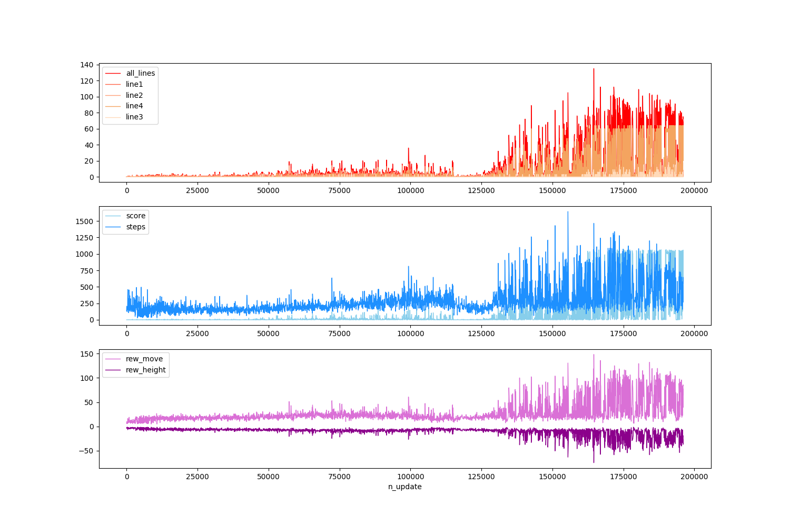

# tetris_A3C

I and my team (Kang Gi-Cheon, Kim Young-Seok, Kim Jin-Rae, Lee Soon-Woo) studied tetris using A3C with class (Introduction to Reinforcement learning)

The A3C is implemented with multi-processing, so you have to modify n_process in main.py that make smaller than your cpu cores.

we attach learning curve and reward status

